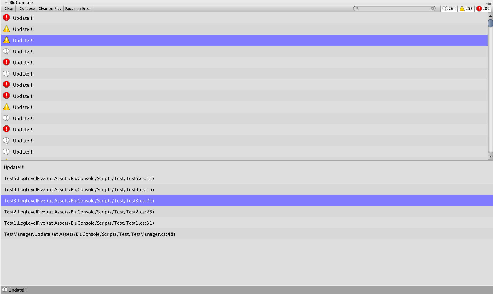
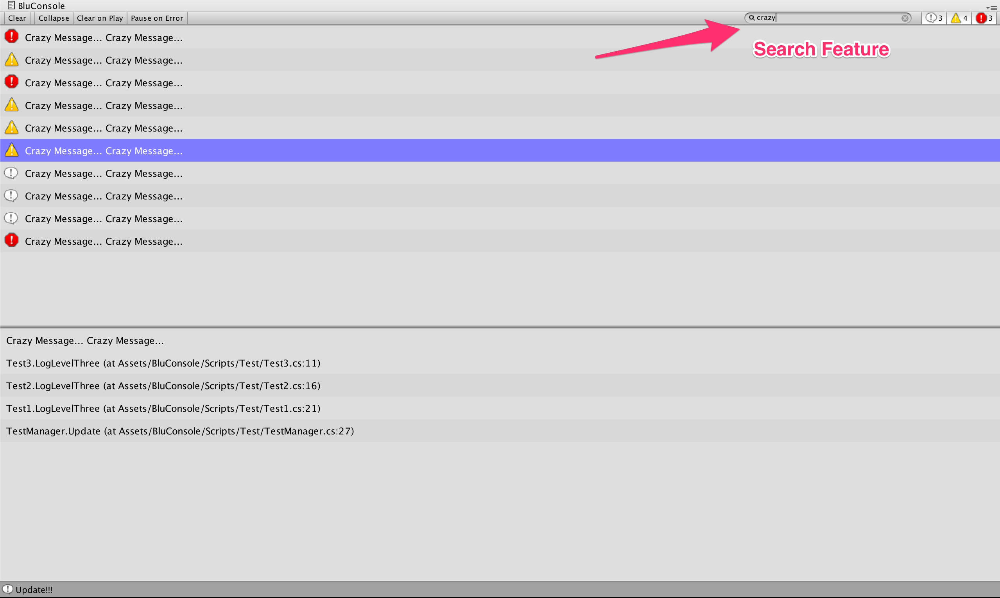
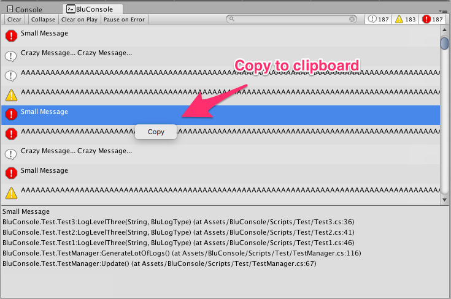
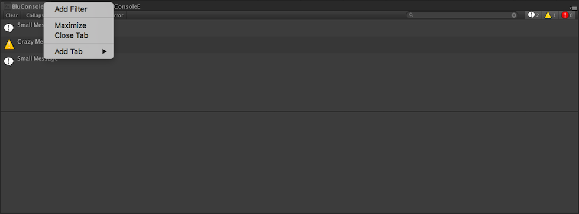
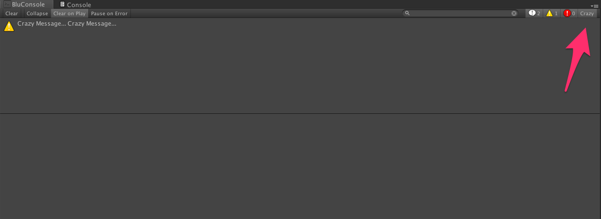

BluConsole 
========================

*Does not work on Unity2017. They changed the API, so I need to decompile the UnityEditor code to figure out the changes*

Are you looking for [images](#images)?

Fell free to contribute! Any PR are welcome.

Any doubts, you can post an issue or send me an email: <gilberto.alexsantos@gmail.com>

To install, just download the **bluconsole.unitypackage**, install it, and open the window on: Window/BluConsole. Simple like that.

Features Implemented
----------------------------

It has all the UnityConsole features, with a few additions:


#### Search Box

Search through your logs.

#### Callstack Navigation

You can open any line of the call stack with a double click.

#### Log Copy

Right click on the Log, and copy the text to the Clipboard. Simple like that!

#### Custom filters

If you catch yourself filtering always by the same query, just put that in the FilterSettings (BluConsole/Resources/BluConsole/BluLogSettings). Or you can right click on the console header tab and select Add Filter (check images).

#### StackTraceIgnore

If you want to ignore a function in the StackTrace, just put the ```[BluConsole.StackTraceIgnore]``` annotation on it.


TODO
----------------------------

* Improve additional filter editor
* Support Regex in the Search Box
* Support for themes (Font size, Colors, etc)

Known Issues
----------------------------

* When filtering logs, the toggles with the number of logs are displayed incorrectly


License
----------------------------

[License](LICENSE)


Copying
----------------------------

[Copying](COPYING)


Images <a name="images"></a>
----------------------------



<hr>



<hr>



<hr>



<hr>



<hr>